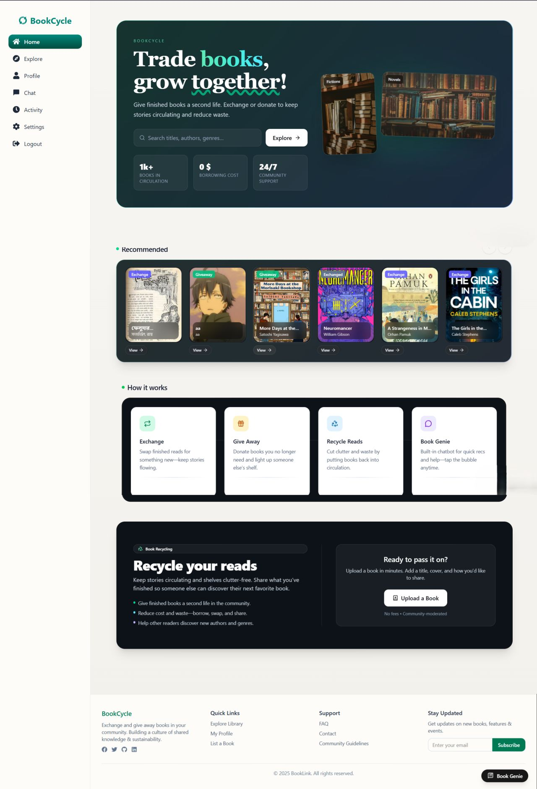

# BookCycle: Community Book Exchange & Giveaway Platform
A community-first platform for exchanging and giving away books. Keep great stories in circulation while **reducing waste and promoting reading-powered recycling**. 📚♻️

---
## Index
- [Project Features](#project-features)
- [Technologies Used](#technologies-used)
- [Sample API Endpoints](#sample-api-endpoints)
- [Live Project](#live-project)
---
## Project Features
### User Authentication
- Registration & Login (JWT)
- Role-based access control: `admin`, `member`
- Google Authentication
### Profile
- Edit profile
- Public shelves: **Gave Away**, **Exchanged**
### Listings & Discovery
- Create **Exchange** or **Giveaway** listings:
  - Title, author, condition grade, photos, tags/genre
  - Preferred handoff method (meetup / drop-point / mail)
- Search & filter: title, author, genre, condition, availability
- Sort: latest, top rated owners, most requested
### Requests & Transactions
- Request an exchange or claim a giveaway
- In-app chat to coordinate handoff
- Status flow: `open → pending → confirmed`
- Show previous transactions
### AI Search — Book Genie
- Smart recommendations (similar authors/genres)
- Auto-tagging & brief summaries to improve discovery
- Typo-tolerant, multilingual queries
### Admin Dashboard
- Manage users, listings, reports
- Moderate content
- Site-wide stats: active exchanges, fulfillment rate, impact metrics
---
## Technologies Used
- **Frontend**: React.js, Vite, Tailwind CSS, React Router, Lucide/React-Icons  
- **Backend**: Node.js, Express.js, Socket.IO  
- **Database**: MongoDB + Mongoose  
- **Auth**: JWT + Google Identity Services (One Tap / ID token)  
- **Storage**: Cloudinary  
- **Version Control**: GitHub
---
## Sample API Endpoints
### Auth (`/api/auth`)
- `POST /api/auth/signup` — Create account  
- `POST /api/auth/login` — Log in (returns `{ user, token }`)  
- `POST /api/auth/google` — Google Sign-In (body: `{ id_token }`)  
- `GET  /api/auth/me` — Current user profile (JWT)  
- `PUT  /api/auth/me` — Update profile (firstName, lastName, avatarUrl)  
- `POST /api/auth/change-password` — Change password (JWT)
### Books (`/api/books`)
- `GET   /api/books` — Query books (supports filters/pagination)  
- `POST  /api/books` — Create listing  
- `GET   /api/books/:id` — Get one  
- `PATCH /api/books/:id` — Update
### Transactions (`/api/transactions`)
- `POST  /api/transactions` — Create request/claim  
- `GET   /api/transactions` — List my transactions  
- `PATCH /api/transactions/:id` — Update status (`pending/confirmed/fulfilled/cancelled`)
### Uploads (`/api`)
- `POST /api/upload` — Upload image (Cloudinary)
> Health checks:  
> `GET /api/health` → `{ ok: true }`  
> `GET /` → "API is working"
---
## Live Project
- **Website:** https://book-cycle-cxry.vercel.app/
